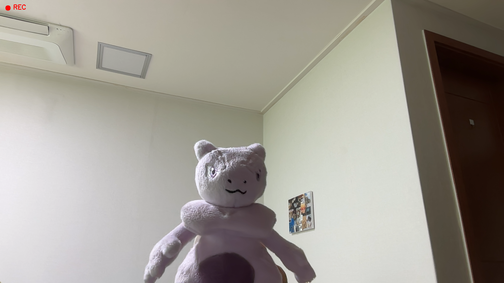

# 🎥 Mai Video Recorder✨

A fun and simple webcam recorder made with **Python + OpenCV** 💻  
Capture moments, apply cool effects, and record videos easily!

---

## Features

- **Real-time Camera Preview**  
  Displays a continuous video stream captured from the webcam.

- **Video Recording**  
  Supports recording and saving video using OpenCV’s `VideoWriter`.

- **Recording Indicator**  
  Indicates recording status with visual markers (red circle and "REC" text).

- **Flip Transformation**  
  Provides horizontal mirroring of the video stream.

- **Grayscale Conversion**  
  Applies real-time grayscale transformation to video frames.

- **Screenshot Capture**  
  Enables saving individual frames as image files.

---

## Controls

| Key | Action |
|-----|--------|
| SPACE | 🎥 Start / Stop recording |
| F | 🪞 Flip camera |
| G | ⚫ Grayscale mode |
| S | 📸 Take screenshot |
| ESC | ❌ Exit |

---
## 🖼️ Preview

## 🎥 Demo Video
[Watch the demo](output.mp4)

## 🛠️ Built With

- 🐍 Python  
- 👁️ OpenCV  

